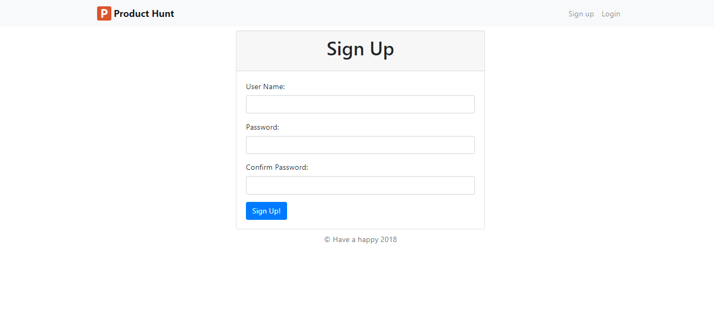

# producthunt-django-project

## Table of Contents

* [Description](#Description)
* [Dependencies](#dependencies)

## Description

This project is Product Hunt Clone which I used Python to create. This web application allows users login or register to create or vote products that they are interested. 

The following photo is the Sign Up page:

## Dependencies

The project is cooperated with a Python framework is Django, a JavaScript framework is Bootstrap and PostgreSQL.